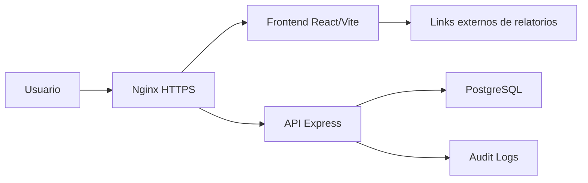

# Arquitetura

## Visao geral

Aplicacao web privada com frontend React, backend Node.js/Express e PostgreSQL.

## Camadas

### Frontend

- React
- Vite
- TypeScript
- Tailwind
- lucide-react para icones
- design system Ad Rock Console UI

### Backend

- Node.js
- Express
- rotas REST
- middleware de autenticacao
- validacao de entrada
- auditoria

### Banco

- PostgreSQL
- tabelas relacionais para usuarios, clientes, relatorios e links
- indices para filtros por cliente, periodo e datas

### Infraestrutura

- AWS Lightsail
- Ubuntu LTS
- Nginx
- Node.js via systemd
- PostgreSQL local na instancia ou gerenciado futuramente
- TLS via Certbot
- dominio `relatorios.porvir.org`

## Multi-cliente

O sistema deve suportar varios clientes em uma unica instalacao. No caso inicial, o cliente principal sera Porvir.

Cada usuario pode estar vinculado a um ou varios clientes. Viewer so consulta clientes associados.

## Reaproveitamento do UTM Builder

O `utm_builder` deve servir como referencia para:

- autenticacao
- gestao de usuarios
- app shell
- branding do topo
- auditoria
- deploy Lightsail
- design system

O codigo deve ser adaptado para o dominio de relatorios, removendo conceitos de UTM que nao se aplicam.

## Decisoes

- Nao armazenar arquivos no MVP.
- Salvar apenas links externos.
- Usar arquivamento para preservar historico.
- Permitir exclusao apenas com confirmacao.
- Guardar auditoria das acoes administrativas.
